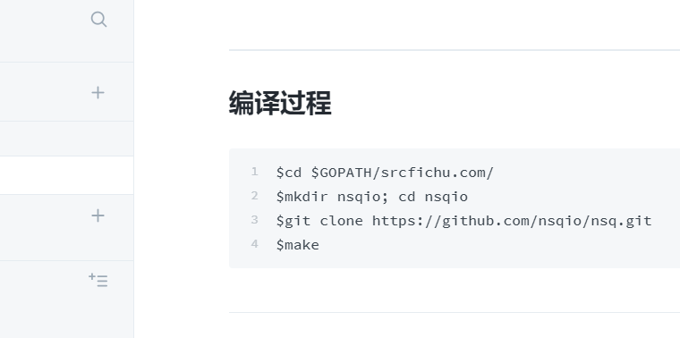

# NSQ学习

MQ的核心用途: 解耦、异步、削峰

## 编译过程

```text
$cd $GOPATH/srcfichu.com/
$mkdir nsqio; cd nsqio
$git clone https://github.com/nsqio/nsq.git
$make
```

## 可执行程序

```text
nsqadmin 		一套 Web 用户界面，可实时查看集群的统计数据和执行各种各样的管理任务
nsqd  			一个负责接收、排队、转发消息到客户端的守护进程
nsqlookupd  	管理拓扑信息并提供最终一致性的发现服务的守护进程
nsq_stat  
nsq_tail  
nsq_to_file  	消费指定的话题（topic）/通道（channel），并写到文件中，有选择的滚动和/或压缩文件。
nsq_to_http     消费指定的话题（topic）/通道（channel）和执行 HTTP requests (GET/POST) 到指定的端点。
nsq_to_nsq  	消费者指定的话题/通道和重发布消息到目的地 nsqd 通过 TCP。
to_nsq
```



